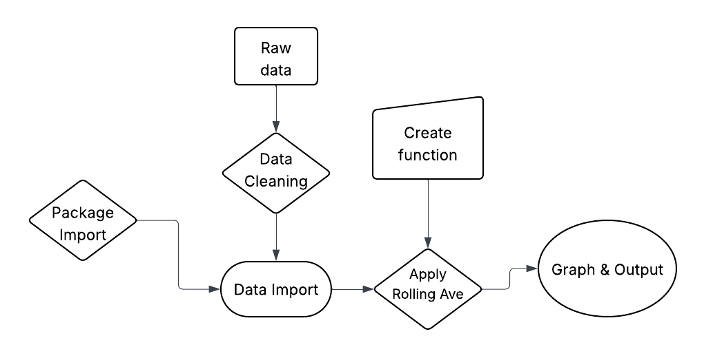

# EDS - 214 Hurricane Final Project

This repo houses the analysis and reproduction of fig 3 of Schaefer, Douglas. A., William H. McDowell, Fredrick N. Scatena, and Clyde E. Asbury. 2000. “Effects of Hurricane Disturbance on Stream Water Concentrations and Fluxes in Eight Tropical Forest Watersheds of the Luquillo Experimental Forest, Puerto Rico.” Journal of Tropical Ecology 16 (2): 189–207. <https://doi.org/10.1017/s0266467400001358>.

## Workflow 
In this workflow I load packages, then I import my cleaned data, applied a rolling mean function, and outputted a graph. 

{fig-align="center" width="400"}

## Contents

-   *data* : all the csv's contained in this folder
    -   QuebradaCuenca1-Bisley.csv
    -   QuebradaCuenca2-Bisley.csv
    -   QuebradaCuenca3-Bisley.csv
    -   RioMameyesPuenteRoto.csv
-   *docs* : HTML of final paper
-   *outputs*: Intermediate Outputs
-   *figs* : Figuresgit a
-   *scratch* : Scratch work that got me to the final docs
-   *R* : Functions I used in my final product
-   *Paper*: Final Paper QMD

## Accessing data

This is not my data. This data was downloaded from EDI following all proper procedures to do so <https://doi.org/10.6073/PASTA/F31349BEBDC304F758718F4798D25458>

## Contributors

Peter Vitale: the main contributor.

## References

-   Paper : <https://doi.org/10.1017/s0266467400001358>
-   Data: <https://doi.org/10.6073/PASTA/F31349BEBDC304F758718F4798D25458>
